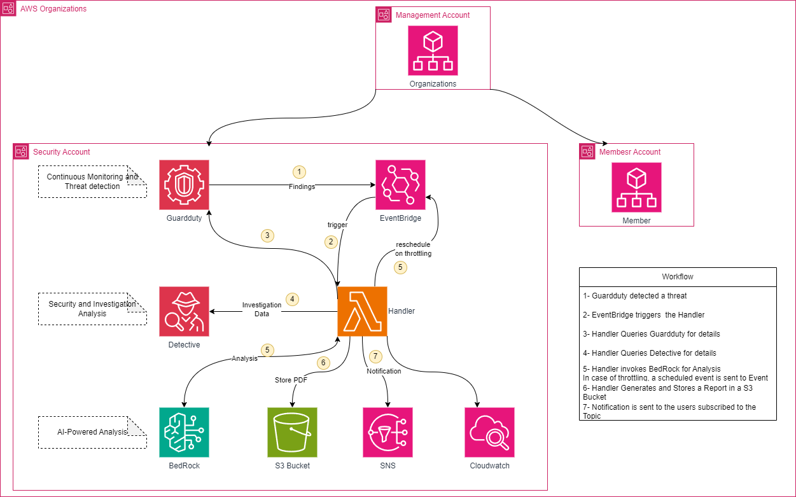

# Integrating AWS GuardDuty, Detective and Bedrock AI for Enhanced Threat Detection, Investigation and AI remediation recommendation.
## Brief Description
As organizations grow and expand their cloud infrastructure across multiple AWS accounts, managing security operations becomes increasingly complex. Security teams face challenges in monitoring and analyzing a vast amount of security data from disparate accounts, identifying threats accurately, and responding to incidents promptly. Traditional security tools may lack the advanced intelligence and centralized visibility needed to combat sophisticated attacks across such expansive environments. Additionally, the manual effort required for compliance and auditing can burden security teams, limiting their capacity for proactive threat response.

Without a unified, AI-powered approach, organizations are at risk of delayed threat detection, inefficient incident response, increased operational costs, and difficulty in maintaining a consistent security posture. This can lead to vulnerabilities in compliance, governance, and overall security resilience, especially in multi-account, large-scale AWS environments.
## Architecture



## Code

### Structure
- app
  - code of the actual application (Lambda function) including unit tests
- cdk
  - code for the infrastructure including unit tests
- docs
  - Documentation


### Pre-requisites

- This is a python project as such python3.12 or higher is requirements
- Poetry is needed to managed the python packages
   - To install poetry run
   - ```
     pip install poetry
     ```

### Setting up the environment
- 1st validate that the pre-requisites are meet
- Create a virtual Environment
  - ```
     python3 -m venv .venv
     ```
- run the make command to install the python dependencies
  - ```
    make install
    ```


### Bootstrap tooling account
```
Ensure you have the right credentials exported into the environment
run: make bootstrap
```

### Deploy the AWS infrastructure to the destination account
- This will deploy the infrastructure into the account.
```
make deploy
```

### Destroy the AWS infrastructure to the destination account
- This will destroy the infrastructure into the account.
```
make destroy
```

### Destroy Bootstrap
- Ensure you have the right credentials exported into the environment
- Ensure that no stacks are remaining, as this will remove the cdk role and then the dependent stacks can't be deleted
```
run: make clean-bootstrap
```
